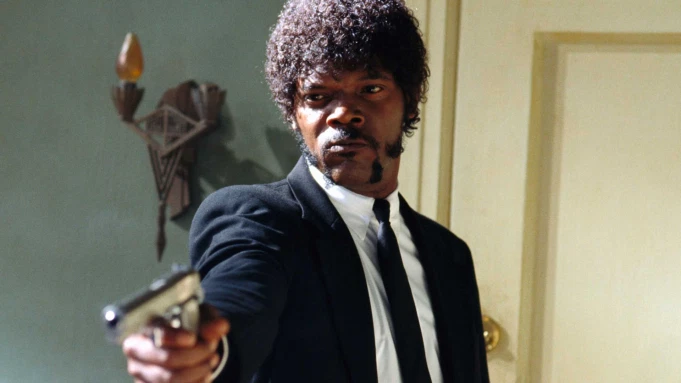

You think water moves fast? You should see ice. It moves like it has a mind.
Like it knows it killed the world once and got a taste for murder. After the
avalanche, it took us a week to climb out. Now, I don't know exactly when we
turned on each other, but I know that seven of us survived the slide... and
only five made it out. Now we took an oath, that I'm breaking now. We said
we'd say it was the snow that killed the other two, but it wasn't. Nature is
lethal but it doesn't hold a candle to man.

 

 

My money's in that office, right? If she start giving me some bullshit about it ain't
there, and we got to go someplace else and get it, I'm gonna shoot you in the head
then and there. Then `I'm gonna shoot` that `bitch in the kneecaps`, find out where my
goddamn money is. She gonna tell me too. Hey, look at me when I'm talking to you,
motherfucker. You listen: we go in there, and that nigga Winston or anybody else
is in there, you the first motherfucker to get shot. You understand?

 

You think water moves fast? You should see ice. It moves like it has a mind.
Like it knows it killed the world once and got a taste for murder. After the
avalanche, it took us a week to climb out. Now, I don't know exactly when we
turned on each other, but I know that seven of us survived the slide... and
only five made it out. Now we took an oath, that I'm breaking now. We said
we'd say it was the snow that killed the other two, but it wasn't. Nature is
lethal but it doesn't hold a candle to man.

 

Normally, both your asses would be dead as fucking fried chicken, but you happen
to pull this shit while I'm in a transitional period so I don't wanna kill you, I
wanna help you. But I can't give you this case, it don't belong to me. Besides, I've
already been through too much shit this morning over this case to hand it over to
your dumb ass.

 

Your bones don't break, mine do. That's clear. Your cells react to bacteria and viruses
differently than mine. You don't get sick, I do. That's also clear. But for some
reason, you and I react the exact same way to water. We swallow it too fast, we choke.
We get some in our lungs, we drown. However unreal it may seem, we are connected,
you and I. We're on the same curve, just on opposite ends.
