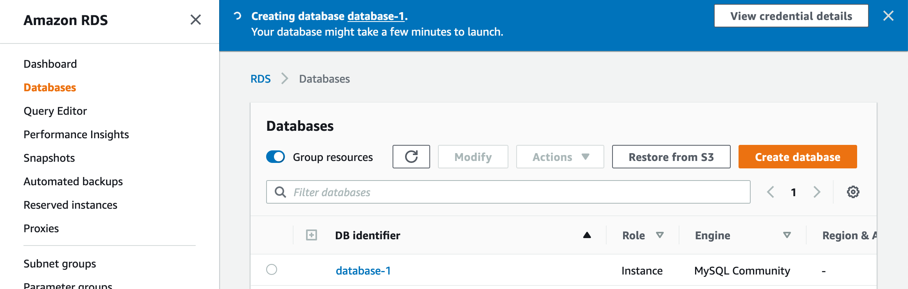
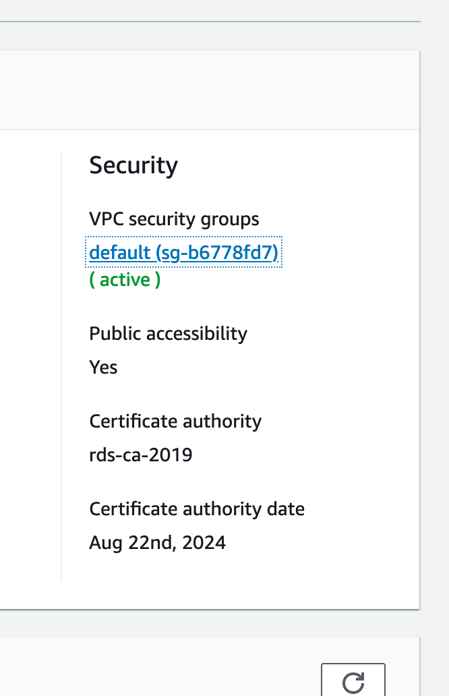

Requirements

- AWS Account
- MySQL Database admin tool

 

You can install the [community MySQL workbench](https://dev.mysql.com/downloads/mysql/) at the link provided. This tutorial assumes that you have MySQL community workbench already installed and an AWS account already created. If you don't have an AWS account setup, you can do so [here](https://aws.amazon.com/resources/create-account/).

You will need a credit card to create your AWS account but we will be using a `FREE TIER` database that gives us a 12 month free trial as long as we stay within its bounds.

**STEP 1: Instantiating a AWS RDS**

From your AWS console, search `RDS`, which stands for Relational Database
Service. Then Click on the link.

Next, in the side `Nav` on the left hand side. Find the link for `databases` and click on it.

We should then see an empty table with a button that says `create database`. Click on it to create a new RDS database instance.

We should now see something like the following.

Keep standard create selected. Then under engine options, choose MySQL

Under the template section, select `Free tier`.

Under the settings sections:

- Name your DB Instance (This will be used as your connection name in MySQL workbench).
- Give you app a username (for now, let's keep it as the default `admin`).
- Give your app a master password (Be sure to remember this as we will be using it later).

Under DB instance size, make surer that `db.t2.micro` is selected.

Under connectivity, switch `Public access` from No to Yes

Under `Additional configuration` , specify an initial database name. If we don't specify one, RDS will not create a database. Let's call it `Test`.

That's the initial setup. At the bottom of the screen hit the button `Create database`.

You will now see our table populated with our new RDS instance. Click on it and you will be shown a message that your db is being created.

Once it's finished being created we can connect it to MySQL workbench.

Open up your workbench and click to create a new connection. Add your DB Instance Identifier as the connection name, In our case it was `database-1`.

Let then add our hostname. We can find it in our RDS instances under the `connectivity & security` section. It's labeled as `Endpoint`.

We can copy the entire string [`database-1.ccecjjyjhtbc.us-east-2.rds.amazonaws.com`](http://database-1.ccecjjyjhtbc.us-east-2.rds.amazonaws.com/). Then past it into our hostname input field.

We can add our username that we created. I left mine as `admin` but if you named yours something different be sure to add that one. Add in your password that you created by selecting the `Store in keychain`. Lastly add the `initial database name` you provided into the `Default Schema` field. In my case, it was `test`.

After our credentials are in, hit `test connection`. If everything goes right the first time you should see this:

If you didn't get that message and it's like you didn't we need to whitelist our IP address in our security group. Back in our RDS Console under `connectivity & security` find the section labeled `Security` look for `VPC security groups` and click on the default link.

This will open up our security groups

At the bottom look for a button labeled `Inbound rules` and click on it.

Click on `Edit inbound rules`, which will take you to a screen that looks like the following.

Look for the header labeled source and click on the dropdown. Change the value of the dropdown from `custom` to `My IP`. Once it reads, `My IP`. Save the rules.

Now head back to your `MySQL` workbench and test your connection again. This time if you didn't see your success message. You should this time!
