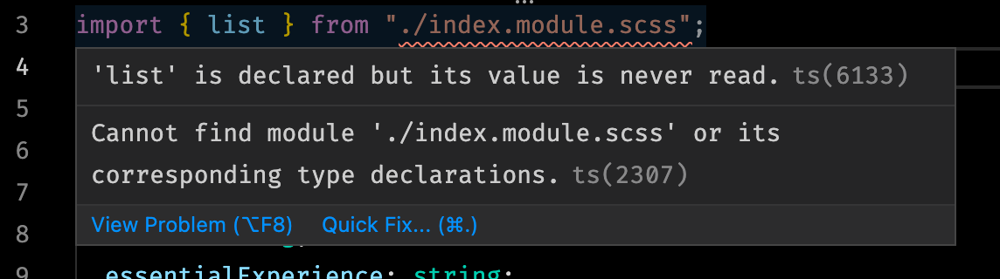

When trying to use `scss modules` in `gatsby-theme-carbon` you're hit with an error immediately.



To fix this is pretty simple. Just add the following snippet to your `global.d.ts`. If you don't have a `global.d.ts` file to the root of the project.

```ts
declare module "*.module.scss" {
  const classes: { [key: string]: string };
  export default classes;
}
```
